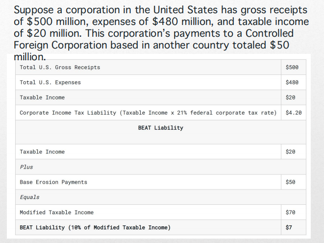
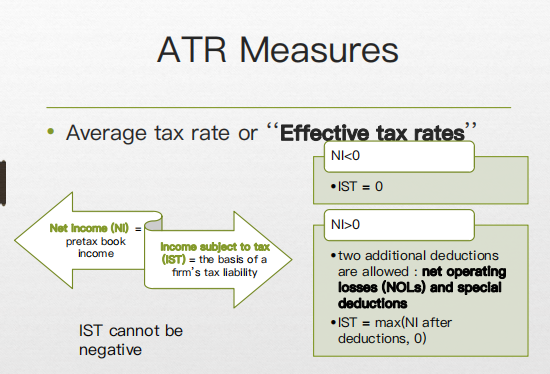
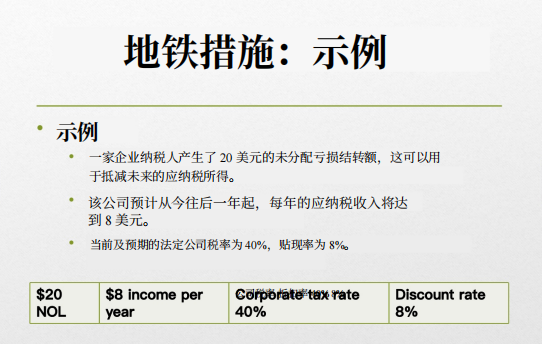
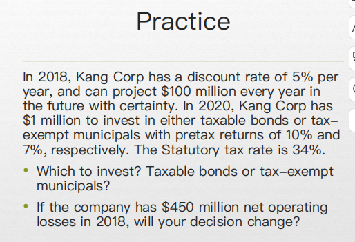
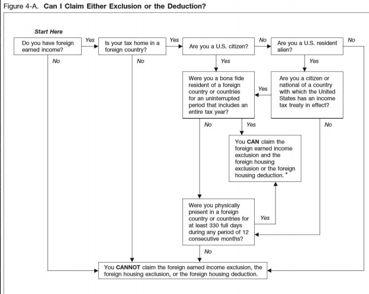

### 1. **外国税收抵免（Foreign Tax Credit）**
   - **定义**：外国税收抵免允许在国外经营的美国纳税人通过抵减已向其他国家支付的外国收入税款，从而减少其在美国应纳的税款。
   - **应用**：这种抵免适用于纳税人在外国赚取的收入，且只限于外国税务机关征收的税款。
   - **意义**：通过外国税收抵免，美国纳税人在国外已经支付的税款不会被再次征税，帮助避免了双重征税的困境。
   - **Key Point**: The Foreign Tax Credit allows U.S. taxpayers operating abroad to reduce U.S. taxes by the amount of tax paid to foreign governments on foreign income. This helps to avoid double taxation.

### 2. **税收豁免（Tax Exemption）**
   - **定义**：税收豁免是指减免或免除个人或组织应缴税款的安排。免税方法通过将纳税人的外国收入视为免税，来减少或消除在居住国的税收责任。
   - **应用**：这种方法适用于外国收入，居住国不对该收入征税。
   - **意义**：税收豁免可以避免在居住国对外国收入的征税，确保纳税人的收入不会受到重复征税。
   - **Key Point**: Tax exemptions allow foreign income to be excluded from taxation in the residence country, ensuring that foreign earnings are not taxed again.

### 3. **税收扣除（Tax Deduction）**
   - **定义**：税收扣除是对纳税人总收入的减少，从而减少计算应税收入的金额。外国税收扣除适用于向外国政府缴纳税款的纳税人。
   - **应用**：外国税收扣除可帮助纳税人通过降低应税收入，将其税负降到更低的税率。
   - **意义**：通过税收扣除，纳税人可能会进入更低的税收等级，支付较少的税款。
   - **Key Point**: Tax deductions reduce a taxpayer's total income, lowering taxable income and potentially leading to lower taxes, particularly for those who pay taxes to a foreign government.

### 4. **资本出口中立性（Capital Export Neutrality, CEN）**
   - **定义**：资本出口中立性要求任何国家的居民在选择投资地点时，不受税收差异的影响，无论是在本国还是外国。
   - **应用**：确保纳税人投资决策不受税收负担影响。
   - **意义**：有助于避免由于税制差异造成的投资扭曲，鼓励跨国投资。
   - **Key Point**: CEN ensures that taxpayers are not influenced by taxation when choosing where to invest, encouraging cross-border investment without tax distortion.

### 5. **资本进口中立性（Capital Import Neutrality, CIN）**
   - **定义**：资本进口中立性要求在同一市场的所有竞争企业面临相同的税负，从而保证税收公平竞争。
   - **应用**：所有在东道国经营的公司都必须按照相同的税率缴税。
   - **意义**：此政策有助于保持市场竞争公平，防止税制不公对外国投资的影响。
   - **Key Point**: CIN ensures that all competing firms in the same market face the same tax burden, promoting fair competition in the host country.

### 6. **双重税收（Juridical Double Taxation）**
   - **定义**：双重税收是指两个国家都声称纳税人是本国居民或收入来源于本国，导致相同的收入被重复征税。
   - **应用**：这种情况可能发生在跨国经营或跨境交易时，需要通过税收协议来避免或减轻这种双重税收。
   - **意义**：通过税收协议，两个国家可以避免对同一收入进行双重征税。
   - **Key Point**: Juridical double taxation occurs when two countries claim a taxpayer as a resident or assert that income arises within their jurisdiction, leading to double taxation of the same income.

### 7. **Laffer Curve**
   - **定义**：Laffer Curve 表明，在0%和100%的税率下，政府都无法收取税收，因为在这两个极端情况下，没有人愿意工作（0%意味着没有收入，100%意味着没有激励）。
   - **应用**：税率有两种影响：算术效应和经济效应。算术效应是税率降低时，税收收入会减少；经济效应则是税率降低时，会激励更多的工作和生产，从而增加税收。
   - **意义**：在适当的税率下，政府可以最大化税收收入；过高的税率可能会降低税收收入。
   - **Key Point**: The Laffer Curve demonstrates that tax rates affect tax revenue through both arithmetic and economic effects, with a balance needed to maximize revenue.

---

### **其他重点概念**

- **税收条约**：税收条约旨在减少或避免双重征税，并可能提供税收减免或免税待遇，适用于外国居民在美国的某些收入。
- **中立性**：税收中立性指的是税制不应影响投资、生产或市场选择。资本出口中立性和资本进口中立性是两种不同的中立性目标，但通常不能同时实现。

---

### **考试复习建议**
1. **理解基本概念**：确保对外国税收抵免、税收豁免和税收扣除等核心概念有清晰的理解。
2. **Laffer Curve的应用**：理解税率变化对税收收入的影响，知道如何平衡税收以最大化政府收入。
3. **税收中立性**：掌握资本出口中立性和资本进口中立性的区别与适用情况。
4. **双重税收问题**：理解如何通过税收条约来避免双重税收，并了解税收条约的基本原则。

祝你考试顺利！如果有其他问题，随时问我哦~

在这张图片中，我们看到的是一家公司计算其**基础侵蚀与反滥用税（BEAT）**的过程。让我们一步一步解释这个计算：

### 公司基本情况：
- **总收入**（Total U.S. Gross Receipts）：500百万美元
- **总支出**（Total U.S. Expenses）：480百万美元
- **应纳税所得额**（Taxable Income）：20百万美元
- 该公司向一家位于其他国家的**控制外国公司**（Controlled Foreign Corporation, CFC）支付了**50百万美元**。

### 计算过程：
1. **企业所得税负担**（Corporate Income Tax Liability）：
   - 按照21%的联邦企业所得税率，企业的应纳税所得额为20百万美元，因此税负为：
     \[
     \text{应纳税所得额} \times 21\% = 20 \, \text{百万美元} \times 21\% = 4.20 \, \text{百万美元}
     \]

2. **基础侵蚀付款**（Base Erosion Payments）：
   - 企业向外国子公司支付了50百万美元，这就是基础侵蚀付款。

3. **修改后的应纳税所得额**（Modified Taxable Income）：
   - 修改后的应纳税所得额是应纳税所得额加上基础侵蚀付款：
     \[
     \text{修改后的应纳税所得额} = \text{应纳税所得额} + \text{基础侵蚀付款} = 20 \, \text{百万美元} + 50 \, \text{百万美元} = 70 \, \text{百万美元}
     \]

4. **基础侵蚀与反滥用税（BEAT）税负**：
   - BEAT税负是修改后应纳税所得额的10%，即：
     \[
     \text{BEAT税负} = 10\% \times 70 \, \text{百万美元} = 7 \, \text{百万美元}
     \]

### 总结：
这家公司通过向外国公司支付基础侵蚀付款（50百万美元），触发了BEAT税的计算。其修改后的应纳税所得额为70百万美元，因此，按照10%的BEAT税率，税负为7百万美元。

BEAT的目的就是防止公司通过转移利润到国外来逃避美国税收。在这种情况下，尽管企业的常规企业税负是4.2百万美元，但通过基础侵蚀付款的调整，最终需要支付7百万美元的BEAT税负，确保公司在美国支付最低税额。
## ATR

这张图片解释了**平均税率（ATR）**和**有效税率**的概念，主要通过“净收入”（Net Income, NI）与“应税收入”（Income Subject to Tax, IST）之间的关系进行说明。以下是解释：

### 关键概念：
- **净收入（NI）**：指的是未扣除税前的账面收入。
- **应税收入（IST）**：这是计算公司税负的基础，也就是根据公司的实际情况扣除后的收入。

### 主要内容：
1. **当净收入（NI）为负值时**（即公司处于亏损状态）：
   - **应税收入（IST）** 为0。
   - 这种情况下，无法征税，因为公司没有正收入。

2. **当净收入（NI）为正值时**（即公司有正收入）：
   - 允许进行两项额外的扣除：**净经营亏损（NOLs）**和**特别扣除**。
     - **净经营亏损（NOLs）**：指的是公司在过去年度的亏损可以带入当前年度进行抵扣。
     - **特别扣除**：通常是通过**股息收入扣除**来进行的。
   - **应税收入（IST）**为“净收入扣除后的最大值”和0之间的较大值。换句话说，如果扣除后的净收入为负数，则应税收入为0。

### 总结：
- 如果公司有亏损（净收入为负），那么其应税收入为0，无法征税。
- 如果公司有盈利（净收入为正），可以通过扣除过去的亏损（NOLs）和其他特别扣除来减少应税收入，确保只有在扣除后的正值部分才会被征税。

## MTR
**MTR（边际税率）** 是指一个人或公司在获得额外一美元收入时需要支付的税率。以下是对MTR的详细解释：

### 边际税率的概念：
- **边际税率（MTR）**：是指在增加一美元收入时，个人或公司需要支付的税额所对应的税率。边际税率反映的是收入增加时的额外税负。
- **影响**：较高的边际税率可能会减少个人或公司的收入激励，因为它使得增加的收入中的一部分被征税，从而减少了获取更多收入的吸引力。

### 对跨国公司的影响：
- **不同国家的税率**：跨国公司在不同国家经营时，会面临不同的法定税率（即每个国家对公司收入征收的税率）。因此，跨国公司需要计算在每个司法辖区内的**特定边际税率**。
- **考虑地方税收**：除了国际税率外，跨国公司还需要考虑**州税或地方税**，这些也会影响税务决策，尤其是在不同地区的投资和运营决策中。

### 总结：
- 边际税率是税收政策的一个重要因素，特别是对于收入较高或跨国经营的个人和企业来说。
- 较高的边际税率可能会影响个人和公司的激励，减少其获得额外收入的动力。
- 对跨国公司而言，了解和计算各国不同的边际税率是制定全球税务战略和决策的重要一步。

### 要衡量 **边际税率**（MTR），通常使用 **Scholes和Wolfson（1992）** 提出的定义。他们定义的边际税率是：

- **边际税率**是指在当前税期内，通过赚取**额外的一美元应税收入**，所导致的支付给税务机关（或从税务机关收回）的现金流现值的变化。

### 关键点：
1. **现金流变化**：计算时，主要关注额外一美元收入如何影响支付给或从税务机关收回的现金流。
   
2. **现值考虑**：计算时考虑了**货币的时间价值**，即将未来的税务负担或退款的现值考虑在内。

3. **额外一美元收入**：边际税率特别关注额外一美元收入的税务影响，不同于平均税率（看总体收入的税负）。

### 为什么重要：
- 这种方法可以更精确地了解额外收入带来的税务负担或税务收益。
- 它有助于**税务规划**和**决策制定**，因为个人或企业可以评估赚取更多收入时税负的变化。

### 例子：
如果赚取额外一美元的收入导致税款增加了35美分，那么边际税率就是**35%**。

### 已知条件：
- **NOL结转金额**：20美元（可以用来抵消未来的应税收入）
- **预计每年应税收入**：8美元，从明年开始
- **公司税率**：40%
- **贴现率**：8%

### 计算步骤：

1. **计算每年的税收减免**：
   每年的NOL结转将减少应税收入，从而减少税款。每年的税收减免可以用以下公式计算：
   \[
   \text{税收减免} = \text{应税收入} \times \text{税率} = 8 \times 0.40 = 3.2 \text{（每年）}
   \]

2. **确定NOL可以使用的年数**：
   公司有20美元的NOL结转，而每年预计有8美元的应税收入，因此NOL将在**2.5年**内用完（20 ÷ 8 = 2.5年）。这意味着NOL将在前两年完全使用，第三年用一部分。

3. **计算税收减免的现值**：
   由于税收减免是未来的现金流，所以我们需要用8%的贴现率将每年的税收减免折算成现值。我们分别计算每一年的现值。

   - 第一年：3.2美元的税收减免，折现1年：
     \[
     PV_1 = \frac{3.2}{(1 + 0.08)^1} = \frac{3.2}{1.08} \approx 2.96
     \]
   - 第二年：3.2美元的税收减免，折现2年：
     \[
     PV_2 = \frac{3.2}{(1 + 0.08)^2} = \frac{3.2}{1.1664} \approx 2.74
     \]
   - 第三年：由于NOL只用了一部分，所以税收减免是3.2美元的一半，即1.6美元，折现3年：
     \[
     PV_3 = \frac{1.6}{(1 + 0.08)^3} = \frac{1.6}{1.2597} \approx 1.27
     \]

4. **计算税收减免的总现值**：
   将每年的现值加起来，得到税收减免的总现值：
   \[
   \text{总现值} = PV_1 + PV_2 + PV_3 = 2.96 + 2.74 + 1.27 \approx 6.97
   \]

### 结论：
这项NOL结转带来的税收减免的现值大约是**6.97美元**。

### 1. **已知信息**：
- **税率**：34%
- **2020年投资金额**：100万美元
- **应税债券的税前回报**：10%
- **免税市政债券的税前回报**：7%
- **2018年的净经营亏损（NOL）**：4.5亿美元（这部分是针对第二个问题的）

### 2. **计算应税债券的税后回报**：
对于应税债券，利息收入需要缴纳公司税。因此，应税债券的税后回报计算公式为：
\[
\text{税后回报（应税债券）} = \text{税前回报} \times (1 - \text{税率})
\]
\[
\text{税后回报（应税债券）} = 10\% \times (1 - 0.34) = 10\% \times 0.66 = 6.6\%
\]

### 3. **计算免税市政债券的税后回报**：
免税市政债券由于不需要缴税，税后回报就是税前回报，即：
\[
\text{税后回报（免税市政债券）} = 7\%
\]

### 4. **2020年Kang Corp应该选择哪种投资？**

- **应税债券的税后回报**是**6.6%**。
- **免税市政债券的税后回报**是**7%**。

因为**7%**高于**6.6%**，所以**Kang Corp应该选择投资免税市政债券**。

---

### 5. **2018年的4.5亿美元净经营亏损是否会改变决策？**

要分析净经营亏损（NOL）是否会影响投资决策，我们需要了解NOL的作用：

- NOL可以帮助公司抵消未来的应税收入，意味着如果公司有NOL，可以减少未来的税务支出。
- 如果Kang Corp有4.5亿美元的NOL，它可以用来抵消未来几年的应税收入，从而可能完全免税。

因此，如果Kang Corp可以使用NOL来减少未来的应税收入，实际上，**应税债券的税后回报**可能会大幅提升。如果NOL足够抵消税务支出，公司的有效税率可能降为**0%**。

我们来重新计算一下，如果税率降为0%，应税债券的税后回报将会变为：
\[
\text{税后回报（应税债券，假设使用NOL）} = 10\% \times (1 - 0) = 10\%
\]

这时我们比较两种选择的税后回报：

- **应税债券（使用NOL后的税后回报）**：10%
- **免税市政债券**：7%

因此，如果Kang Corp能够利用NOL完全抵消税务支出，那么**应税债券的税后回报**（10%）将高于免税市政债券的回报（7%）。

### 结论：
- 如果不考虑NOL，Kang Corp应该选择**免税市政债券**，因为其税后回报（7%）高于应税债券（6.6%）。
- **如果公司有足够的NOL**来抵消税务支出，Kang Corp应该选择**应税债券**，因为此时应税债券的税后回报（10%）会高于免税市政债券的回报（7%）。

所以，**有NOL的情况下，决策会发生变化**，公司应选择应税债券。
# chapter3阶段总结
### **Worldwide Tax System (全球税制)**

全球税制指的是一个国家对其居民（无论其收入来源地在何处）征税的制度。在全球税制下，**居民税务居民** (tax residence) 需要对其全球范围内的收入（包括来自其他国家的收入）缴纳税款。全球税制与**属地税制** (territorial tax system) 对比，后者只对国内收入征税，不涉及海外收入。

#### 关键点：
- **全球征税** (Worldwide taxation) 是指一个国家对其税务居民的所有收入进行征税，无论这些收入是来自本国还是海外。
- **居民税务居民** (tax residence) 是指在某个国家具有长期居住或经济联系的人。
- **海外税收抵免** (foreign tax credit) 常常用于避免双重征税。

---

### **ATR (Average Tax Rate, 平均税率)**

**ATR（平均税率）** 是指公司或个人总税负占总收入的比例。它表示实际支付的税额与总收入的关系，通常用于衡量整体税负水平。

#### 计算公式：
\[
\text{ATR} = \frac{\text{总税额}}{\text{总收入}} \times 100\%
\]

例如，如果某公司收入为100万元，支付税款为30万元，那么其ATR为30%。

---

### **MTR (Marginal Tax Rate, 边际税率)**

**MTR（边际税率）** 是指额外的收入所需缴纳的税率。它指的是在一个人或公司的收入增加时，新增的收入部分所适用的税率。边际税率是税收政策的重要参考指标，反映了税率的逐步递增或递减情况。

#### 关键点：
- **边际税率**通常适用于**新增收入**（例如，若税制是累进税制，收入越高，边际税率越高）。
- 边际税率在评估个人或公司**收入增加后的税务影响**时非常有用。
  
例如，在累进税制下，一个人收入为10万元时的税率是20%，如果收入增加到12万元，超过的部分可能会按更高的税率（如30%）征税，这个较高的税率就是其边际税率。

#### 计算公式：
边际税率是指税额的增量与收入的增量之间的比例。

\[
\text{MTR} = \frac{\text{税额变化}}{\text{收入变化}}
\]

---

### 总结：

- **全球税制** (Worldwide Tax System) 要求居民对全球收入征税。
- **ATR（平均税率）** 是税收负担与总收入的比率，衡量整体税负水平。
- **MTR（边际税率）** 反映新增收入部分的税率，通常适用于累进税制下对收入的增加部分进行征税。

### **Two-Level Taxation (双重征税)**

在美国税制中，**双重征税**是指公司所得税和股东分红税两次征税。美国税制通常承认公司的独立法人身份，即使这些公司由单一股东或少数股东所有和控制。具体来说，双重征税主要表现在以下两个方面：

1. **公司层面的税收**（Corporate Level Taxation）：
   - 当公司赚取利润时，它需要对其收入缴纳公司所得税。美国的公司所得税率通常适用于公司的总收入，即使公司完全由一个股东或一个小集团控制。
   - **公司税** (corporate income tax) 是对公司净收入的征税。在美国，公司的收入会在扣除成本和费用后，按照适用的公司所得税率缴纳税款。

2. **股东层面的税收**（Shareholder Level Taxation）：
   - 在公司向股东分红时，股东需要对这些分红收入缴纳个人所得税。这意味着即使公司已经对利润支付了税款，当这些利润作为**分红** (dividends) 分配给股东时，股东也会再次被征税。
   - 这种情况下，股东对收到的分红收入需要缴纳个人所得税，税率通常是较低的**股息税率**（qualified dividend rate），但是仍然存在第二次征税。

#### 关键点：
- **双重征税**是美国公司税制的一大特点。
- 第一次征税发生在**公司**层面，第二次征税发生在**股东**层面。
- 这种税制的核心是公司和股东被视为两个独立的税务实体。

### 举个例子：
假设一家公司赚取了100万美元的利润，按公司所得税率（假设是21%）缴纳税款后，剩余79万美元可供分红。如果公司决定将这些79万美元作为股息分配给股东，股东再按照股息税率（假设是15%）缴税。

1. **公司层面**：公司先缴纳21%的税，即100万 × 21% = 21万，剩余79万。
2. **股东层面**：股东对这79万股息收入按15%的税率缴纳税，即79万 × 15% = 11.85万。

因此，最终的税负是公司和股东分别缴税的两次征税，形成双重征税。

## **Triple Taxation Treatment for Domestic Corporations: DRD (股息扣除法)**

在美国，**股息扣除法**（Dividends Received Deduction，简称 DRD）是为某些公司提供的一项联邦税收扣除。该扣除适用于那些从相关公司收到股息的公司，旨在减少重复征税的负担，并鼓励公司之间的投资。

#### **DRD的关键特点**：
1. **适用公司**：DRD主要适用于**国内公司**（domestic corporations），即位于美国的公司。
   
2. **相关公司**：DRD仅适用于从**相关实体**（related entities）收到的股息。通常，相关实体是指拥有一定比例股权的公司，例如母公司与子公司之间的股息。

3. **股息扣除的计算**：一个公司可以根据其在股息支付公司中的**所有权比例**（ownership percentage），从其应纳税收入中扣除一定金额的股息。这种扣除的比例根据公司在分红公司中的股权比例而定。

#### **DRD的扣除比例**：
- 如果一个公司拥有**不到20%**的股权，能够扣除股息的**50%**。
- 如果一个公司拥有**20%至80%**的股权，能够扣除股息的**65%**。
- 如果一个公司拥有**超过80%**的股权，能够扣除股息的**100%**。

#### **为什么DRD存在？**
- **减少重复征税**：DRD的目的是减少公司间的重复征税，因为母公司在子公司分红后已经被征税。如果不实施DRD，母公司收到的股息将被视为收入，母公司还需要对这些股息收入缴纳税款，这会导致**三重征税**（Triple Taxation）。通过DRD的扣除，公司可以避免这种三重征税。
- **鼓励公司间投资**：DRD旨在鼓励公司之间的投资和股息支付，避免对公司之间的资金流动造成过大税负。

#### **三重征税的示例**：
假设A公司拥有B公司60%的股权，B公司向A公司支付了股息，A公司可以通过DRD从应税收入中扣除B公司股息的65%（基于其股权比例）。如果没有DRD，A公司将不得不为收到的股息缴纳税款，导致额外的税务负担。

1. **B公司税前利润**：100万
2. **B公司支付的股息**：100万
3. **B公司缴纳的公司税**：假设是21%，B公司需要缴纳21万的税款，剩余79万作为股息分配给A公司。
4. **A公司**：A公司收到79万股息，根据其60%的股权比例，A公司可以扣除65%的股息收入，即：
   \[
   79万 \times 65\% = 51.35万
   \]
   这样A公司就可以从其应税收入中扣除51.35万，减少税负。

#### **DRD的作用**：
DRD能有效减少公司受到的税务压力，避免母公司对子公司支付的股息再次受到重税，因此实现了避免**三重征税**的目的。

### **总结**：
- **DRD（股息扣除法）**通过让公司扣除来自相关公司的股息收入，减少了公司之间的重复征税。
- 这个扣除比例依赖于公司在分红公司中的股权比例，股权越高，能够扣除的比例越大。
- **三重征税**指的是一个公司从子公司收到股息后，如果不使用DRD进行扣除，母公司、子公司以及股东都可能会受到税收征收。DRD的引入帮助解决了这个问题。

### **Repatriation (资金归国)**

**资金归国**指的是跨国公司将其在国外子公司所赚取的利润转移回母公司（通常是美国母公司）的过程。这通常涉及将海外收入转为国内收入，并对这些资金支付税款。在美国税制下，资金归国涉及以下几个方面：

#### **1. GAAP（公认会计原则）**:
- **GAAP**（Generally Accepted Accounting Principles）是美国会计标准，规定了公司财务报告和合并的要求。
- 根据GAAP规定，公司需要将所有子公司的财务状况合并报告，**包括国内和外国子公司**。这意味着母公司需要合并其子公司的财务报表，并向股东和监管机构报告其总体财务状况。

#### **2. 美国税务申报**:
- 在美国的税务申报中，通常包括**美国母公司**、**美国子公司**以及**外国子公司的汇款收入**（即通过资金归国的海外收入）。
- 对于跨国公司来说，归还的**海外收入**（例如，从外国子公司回流的股息或其他支付）需要在美国母公司的税表中报告。

---

### **Tax Deferral (税收递延)**

**税收递延**是指海外公司赚取的利润在美国税务系统下，在未被**分配为股息**的情况下，不需要立即缴纳税款。税款的缴纳仅在**利润分配给美国母公司**（即**资金归国**）时才发生。

#### **关键点：**
- **外国公司赚取的收入**：如果外国子公司赚取了收入，按照美国税法，只有当这些收入作为**股息**被分配给美国母公司时，才需要被征税。
- **税收递延的目的**：这一制度允许公司将收入留在海外，避免立即缴纳美国税款。企业可以通过推迟股息的分配来推迟纳税，从而减轻当前的税务负担。
- **分配时的税收**：一旦**股息分配到美国**时，母公司需要对这部分资金缴纳美国税款，这个过程被称为**资金归国**。

#### **示例**：
假设A公司是美国的母公司，B公司是其在外国的子公司。如果B公司在海外赚取了100万利润，A公司不需要为这些收入支付美国税款，直到B公司将这些利润作为股息分配给A公司。如果B公司将利润分配给A公司，A公司需要按照美国税率对收到的股息支付税款。

---

### **总结**：

1. **Repatriation**（资金归国）是指将外国子公司赚取的利润带回美国母公司，这通常会触发税务事件，母公司需就这些收入缴纳税款。
2. **GAAP**要求公司合并其所有子公司的财务数据，包括国内和外国的子公司。
3. **Tax Deferral**允许跨国公司将其在外国子公司赚取的收入延迟征税，只有在这些收入作为股息分配给美国母公司时，才需要缴纳税款。

## 总结：今天我们学习了美国税制中的几个重要概念：

1. **双重征税（Two-level taxation）**：
   - 在美国，公司的收入首先在公司层面缴纳税款，然后在股东分红时，股东再次为这些分红缴税。这种安排导致了公司和股东的双重征税。

2. **股息扣除法（DRD）**：
   - DRD是为某些公司提供的一项税收扣除，允许公司从应税收入中扣除来自相关公司（如子公司）的股息。扣除的金额取决于公司在分红公司中的所有权比例，目的是减少重复征税，避免三重征税。

3. **资金归国（Repatriation）**：
   - 资金归国指的是将外国子公司赚取的利润带回美国母公司。在美国税制下，外国子公司赚取的收入只有在作为股息分配给美国母公司时，才会被征税。

4. **税收递延（Tax Deferral）**：
   - 税收递延意味着外国公司赚取的利润只有在分配给美国母公司时，才需要缴纳税款。这让公司可以推迟缴税，直到资金真正归国。

# chapter4
### **Taxing Jurisdiction（税收管辖权）**

在国际税收中，**税收管辖权**是指一个国家有权对收入进行征税的法律权限。通常，税收管辖权分为两种类型：**源泉管辖权**和**居住管辖权**。

#### **1. Source Jurisdiction（源泉管辖权）**
- **定义**：源泉管辖权是指某个国家对从该国来源的收入征税的权利。
- **“Nexus”**：源泉管辖权的关键是**“联系”（nexus）**。如果某个收入与特定国家之间存在充分的联系（例如，收入来源于该国），那么该国就有权对这些收入征税。
- **示例**：如果一个外国公司在美国赚取了收入，美国可以对这些收入征税，因为这些收入的来源是美国。

#### **2. Residence Jurisdiction（居住管辖权）**
- **定义**：居住管辖权是指一个国家对其居民的全球收入进行征税的权利。
- **“Nexus”**：在居住管辖权下，征税的依据是**“与人之间的联系”**。即如果某个国家的税法认为某个人是该国的居民，那么这个国家就有权对这个人全球范围内的收入征税。
- **示例**：如果一个美国公民在国外赚取收入，美国仍然可以对其全球收入征税，因为该公民被视为美国的居民。

#### **源泉管辖权与居住管辖权的差异**：
- **源泉管辖权**关注的是收入的来源，即收入产生的地方（例如，来自某个国家的劳动收入或投资收益）。
- **居住管辖权**关注的是收入赚取者的居住地，即该收入的所有者是哪个国家的居民。

#### **总结**：
- **源泉管辖权**：根据收入的来源地对收入征税。
- **居住管辖权**：根据个人的居住地对其全球收入征税。

### **The Residence of U.S. Citizens and Foreign Earned Income Exclusion (FEIE)**

在美国税法中，美国公民的税务居住地决定了其是否需要为全球收入纳税。对于非居民公民（即住在美国以外的公民），可以根据具体情况选择适用**外国收入免税（Foreign Earned Income Exclusion，FEIE）**和**外国住房扣除（Foreign Housing Deduction）**。

#### **Foreign Earned Income Exclusion (FEIE)（外国收入免税）**
- **定义**：**外国收入免税（FEIE）**是指美国公民或美国居民可以免除一定额度的外国收入税。这样，收入的一部分将不被计算在美国的应纳税收入中，进而避免双重征税。
  
- **调整情况**：FEIE额度每年都会根据通货膨胀进行调整。以下是一些历史额度：
  - 2006年：$8,400
  - 2011年：$92,900
  - 2013年：$97,600
  - 2015年：$100,800
  - **注意**：额度每年变化，具体数额可以参考当年的规定。

#### **Exclusive FEIE（仅限FEIE）**
- **限制**：如果选择使用**外国收入免税**，那么不能同时享有**外国税收抵免**或**外国税收扣除**。也就是说，如果你选择免除部分外国收入，不可以再通过外国税收抵免或扣除来减少美国的税负。
- **撤销**：如果你已经选择了外国收入免税，但在未来某一年再申报外国税收抵免或扣除，美国税务局将取消你的**外国收入免税**选择，从那一年起就不再适用。

#### **Additional Child Tax Credit（额外子女税收抵免）**
- 如果你选择了外国收入免税，**额外子女税收抵免**（Additional Child Tax Credit）也将无法申报。也就是说，免除外国收入的税务处理将影响你是否能享有这一税收优惠。

#### **总结**
- **外国收入免税（FEIE）**是美国公民在居住国外时的一项重要税务优惠，允许他们免除一部分在国外赚取的收入。额度每年都会根据通货膨胀调整。
- 如果选择FEIE，无法同时享有外国税收抵免或扣除，且如果以后需要申报这些抵免或扣除，将撤销FEIE的选择。
- 选择了FEIE的人也不能再申报**额外子女税收抵免**。

### **1.Bona Fide Residence Test（真实居住测试）**

**定义**  
**Bona Fide Residence Test（真实居住测试）**是美国税务居民身份判定的一个标准，用于判断美国公民或居民是否符合**外国收入免税（Foreign Earned Income Exclusion, FEIE）**的资格。

---

#### **测试要求**
1. **居住目的（Intention or the Purpose of Your Trip）**  
   需向美国国税局（IRS）证明，前往外国居住的目的是真实的，而非为了逃避税务责任。

2. **居住性质和期限（Nature and Length of Your Stay Abroad）**  
   - 必须在外国有一个明确的居住地，并且居住的时间较长。
   - 居住期间需包括**整个纳税年度**（一个完整的日历年）。

3. **中断情况（Uninterrupted Period）**  
   - 所谓的“未中断居住”并非绝对意义上的无间断。短期的出国旅行、回美国度假或因商务短暂离开，都不会影响居住状态。

4. **个案判定（Case-by-Case Basis）**  
   - IRS根据申请者的具体情况决定是否符合要求，而不是以单一标准裁定。

5. **完整税年（Entire Tax Year）**  
   - 居住期必须涵盖从1月1日到12月31日的整个税务年度。

---

#### **适用场景**
- 如果满足**真实居住测试**，可以申请**外国收入免税（FEIE）**，从应税收入中排除符合条件的外国收入。

---

#### **注意事项**
- **短期回国影响**：  
   偶尔回美国探亲、休假或从事短期工作，只要不打破总体上的居住连贯性，不会影响真实居住状态。
  
- **具体说明文件**：  
   纳税人需提供证据（如居住证明、外国税单、房屋租赁合同等），以支持自己的居住声明。

---

#### **总结**
**真实居住测试**需要纳税人证明在外国的居住是真实且连续的，必须包括整个税务年度，但短期的中断不会影响这一测试资格。满足条件后，可以申请**外国收入免税**，减少在美国的税务负担。

### **2.Physical Presence Test（实际在场测试）**

**定义**  
**Physical Presence Test（实际在场测试）**是用于判定纳税人是否符合**外国收入免税（Foreign Earned Income Exclusion, FEIE）**资格的一个标准，基于纳税人在外国的实际停留天数。

---

#### **测试要求**
1. **时间要求（330 Full Days in 12 Consecutive Months）**  
   - 在连续的12个月内，纳税人必须在一个或多个外国实际停留满**330整天**。
   - **整天（Full Day）**：24小时连续计算，从午夜开始到第二天午夜结束。

2. **仅基于停留时长（Stay Duration Only）**  
   - 不考量旅行的目的或意图。
   - **计算范围**：可以包括任何原因导致的停留（如工作、旅行、度假等）。

3. **国际水域规则（International Waters Rule）**  
   - 从美国前往外国或从外国返回美国时，在**国际水域**或其上空停留的时间**不计入**330天。

---

#### **关键注意点**
1. **计算细节（Counting Days）**  
   - **整天定义**：必须整天（24小时）在外国停留，才算1天。半天或部分时间不计入。
   - **时间中断**：若连续12个月中有短暂回美或停留在国际水域，这些天不会计入330天。

2. **连续性要求（Consecutive Months）**  
   - 虽然是连续12个月，但这12个月不需要与日历年一致。例如，可以是从2023年6月至2024年5月。

3. **灵活性（Flexibility）**  
   - 旅行或停留的意图和目的并不重要，只要实际符合天数要求即可。

---

#### **适用场景**
- 如果符合实际在场测试，可以申请**外国收入免税（FEIE）**，从美国应税收入中排除符合条件的外国收入。

---

#### **总结**
**实际在场测试**是通过纳税人在外国停留天数来判定资格的一个客观标准。只要在12个月内累计达到330整天，无论停留的原因是什么，都可以满足这一测试。计算天数时需小心考虑国际水域停留和部分天数的处理。如果有任何问题或需要具体的案例分析，可以随时问我哦～ 😊

好的！😊

---

### **居民与非居民的税收影响**

#### **美国税法下的居民（Resident）**
- **全球收入征税**：美国居民需要申报并缴纳其全球范围内的所有收入所得税，无论收入是在美国境内还是境外获得的。  
- **避免双重征税**：如果已经为国外收入缴纳了税款，居民可以通过 **外国税收抵免（Foreign Tax Credit）** 或 **税收扣除** 来避免双重征税。

#### **非居民（Nonresident）**
- 非居民只需对以下两类收入缴税：  
  1. **来源于美国的收入（U.S.-Source Income）**  
  2. **与美国贸易或业务有关的收入（Income Effectively Connected with a U.S. Trade or Business）**  

例如：在美国赚取的工资、美国房产的租金收入等。非居民通常不能享受居民所拥有的大多数税收扣除或抵免。

---

### **美国居民身份的认定标准**

#### **1. 绿卡测试（Green Card Test）**
如果你持有 **绿卡（永久居民身份）**，你会被视为美国居民并需要按照居民的税收规则缴税。  
关键点：  
- 永久居民需按全球收入缴税。  
- 如果 **离开美国超过6个月**，会被推定为中断居住，除非能证明依然维持了与美国的紧密联系（如仍在美国工作、保留住所或持有再入境许可）。  
- 如果 **离开美国超过1年**，通常会自动失去连续居住资格，除非在国外的工作是为美国政府、美国企业或国际组织服务。

---

#### **2. 实质居留测试（Substantial Presence Test）**
通过此测试判断外籍人士在美国的停留时间是否足够长，以被认定为居民。

- **183天规则（183-Day Rule）**：  
  如果你在某个日历年内在美国停留了 **183天或更多**，你会被视为居民。  
  （避免方法：每年在美国停留时间限制在183天以下。）

- **扩展的183天规则（加权平均规则）**：  
  即使在当前年份内少于183天，但如果：  
  1. **当前年份在美国停留了至少31天**；  
  2. **过去3年内的加权停留时间总和达到183天或以上**，你仍可能被视为居民。

- **加权公式**：  
  - 当前年份的天数 = **全算**（×1）  
  - 前一年在美国的天数 = **乘以1/3**  
  - 再前一年的天数 = **乘以1/6**  
  如果总和≥183天，则满足居民标准。

---

### **总结**
- **居民**：全球收入需申报，可能通过税收抵免避免双重征税。  
- **非居民**：仅需对美国来源或与美国业务有关的收入缴税。  
- 判断是否为居民主要通过 **绿卡测试** 或 **实质居留测试**，183天规则是关键标准之一。

### **场景分析**

#### **情况 1**：  
学生在**6月1日**毕业后**一个月内离开美国**。

- **实质居留测试 (SPT)**：  
  要通过SPT，需要满足**183天规则**，包括当年以及前两年的加权天数计算。  
  如果学生在毕业后**一个月内离开**（约30天），当年在美国的居留天数**不足183天**。

- **结论**：  
  学生**不满足实质居留测试**的要求，会被视为**非居民外国人**（nonresident alien）。

---

#### **情况 2**：  
学生毕业后**留在美国至年底**（再增加213天）。

- **SPT天数计算**：  
  - 从毕业后的居留时间（6月1日到12月31日）：**213天**  
  - 当年总居留时间：**213天**（超过183天的门槛）。  

- **结论**：  
  学生通过了**实质居留测试**，会被视为**居民外国人**（resident alien）。

---

### **更紧密联系例外（Closer Connection Exception）**  
即使学生满足了SPT（例如超过183天居留时间），但如果以下两点成立，也可能仍被视为**非居民外国人**：  
1. 学生的**税收住所**（tax home）位于外国；  
2. 学生与该外国的联系**比与美国更紧密**。  

**税收住所的定义**：  
- 税收住所是指你的主要工作地点或长期任职的地方；  
- 如果没有固定的工作地点，则是你经常居住的地方；  
- 税收住所必须贯穿整个当年，并且必须位于同一个外国。  

这两项条件需要向IRS提供充分证据，才能申请更紧密联系例外。

## 几种测试总结

### **1. 真实居住测试 (Bona Fide Residence Test)**
- **目的**：用于判定是否符合外国收入免税（FEIE）资格。
- **要求**：
  - **居住目的**：需证明前往外国居住的目的是真实的，而非为了逃避税务责任。
  - **居住时间**：必须在外国有明确居住地，并且居住时间必须涵盖整个税务年度（1月1日至12月31日）。
  - **居住期间不中断**：短期回美国不影响判定。
  - **案例评估**：由美国国税局（IRS）根据具体情况判定。
- **总结**：如果符合此测试，可申请外国收入免税。

### **2. 实际在场测试 (Physical Presence Test)**
- **目的**：也用于判定是否符合外国收入免税（FEIE）资格。
- **要求**：
  - **停留时长**：在连续12个月内，需在外国停留满330整天。
  - **计天原则**：必须是整天停留（24小时），不考虑旅行目的。
  - **不计国际水域停留**：从美国到外国的航程中的国际水域时间不计入。
- **总结**：只要在12个月内累积330天，即可符合此测试要求。

### **3. 绿卡测试 (Green Card Test)**
- **目的**：判定是否被视为美国税务居民。
- **要求**：
  - 持有美国绿卡（永久居民身份）即被视为美国税务居民。
  - 如果离开美国超过6个月，除非能证明维持紧密联系，否则可能中断居住。
  - 如果离开美国超过一年，通常会失去居住资格，除非有特殊情况（如为美国政府或国际组织工作）。
- **总结**：绿卡持有者按全球收入缴税。

### **4. 实质居留测试 (Substantial Presence Test)**
- **目的**：用于判断外籍人士是否满足在美国居住的条件，成为税务居民。
- **要求**：
  - **183天规则**：在当前年份内在美国停留183天或以上，将被视为居民。
  - **加权规则**：即使今年在美国停留不足183天，但如果过去三年内加权停留时间达到183天以上，也会被视为居民。
  - **加权公式**：  
    - 当前年份的停留天数：全额计算。
    - 前一年和前两年的停留天数：分别按1/3和1/6的比例计算。
- **总结**：根据183天的停留标准或加权规则，满足条件即为美国税务居民。

---

### **总结**：
- **真实居住测试**：适用于美国公民或居民判断是否在外国长期居住，满足条件可享外国收入免税。
- **实际在场测试**：基于纳税人在外国停留天数，满足330天即符合外国收入免税资格。
- **绿卡测试**：绿卡持有者自动成为美国居民，需按全球收入缴税。
- **实质居留测试**：基于纳税人在美国的停留天数，通过183天规则和加权规则判断是否为税务居民。

这几种测试是用来确定纳税人是否需按美国税法为其全球收入缴税的标准。

# chapter 5
